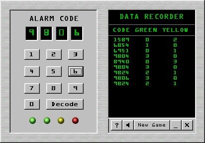

## Code Cracker 2001 \(Game\)

### Description

This is a simple code breaking type game I

whipped up in a couple of days to help out

beginning programmers who are learning the

basics. I used only a few functions in the

custom.bas file to keep confusion to a minimum

and show how they are done. I used no arrays

so people could see a fun windows game can be

written using only the basics. If you know how

to use If-Then statements you'll understand the

code. Everything is heavly commented to help

you understand the logic flow of the game.

Please don't flame me about how much more

"optimized" the code could have been cause I

didn't plan it out before writing it and I

wanted to keep the code at a beginners level.

I hope someone can learn a few things from

this, I enjoy helping out.
 
### More Info
 

             |
---                |---
**Submitted On**   |2001-01-04 17:33:00
**By**             |[Roger Lee](https://github.com/Planet-Source-Code/PSCIndex/blob/master/ByAuthor/roger-lee.md)
**Level**          |Beginner
**User Rating**    |4.8 (38 globes from 8 users)
**Compatibility**  |VB 4\.0 \(32\-bit\), VB 5\.0, VB 6\.0
**Category**       |[Games](https://github.com/Planet-Source-Code/PSCIndex/blob/master/ByCategory/games__1-38.md)
**World**          |[Visual Basic](https://github.com/Planet-Source-Code/PSCIndex/blob/master/ByWorld/visual-basic.md)
**Archive File**   |[CODE\_UPLOAD13374142001\.zip](https://github.com/Planet-Source-Code/roger-lee-code-cracker-2001-game__1-14124/archive/master.zip)

